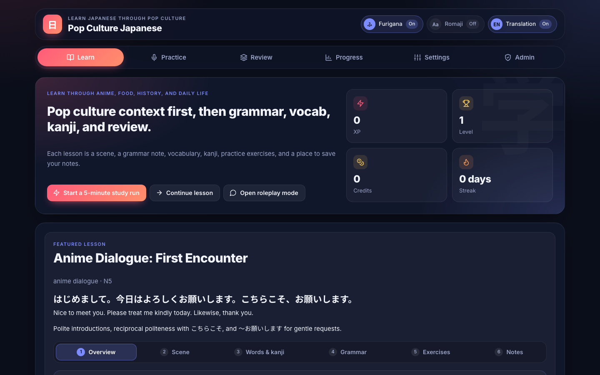
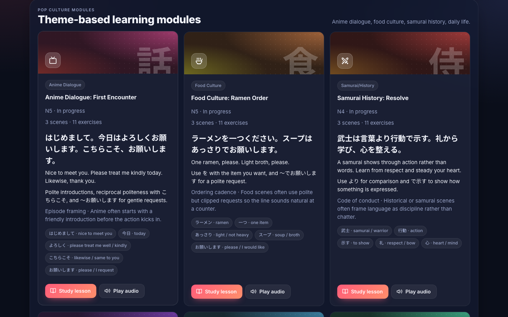
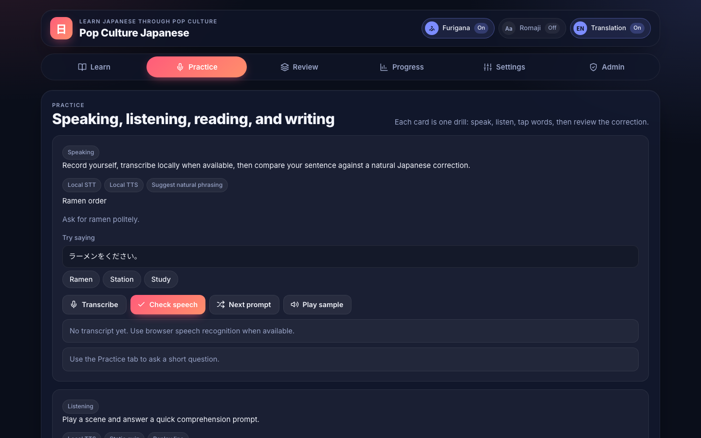
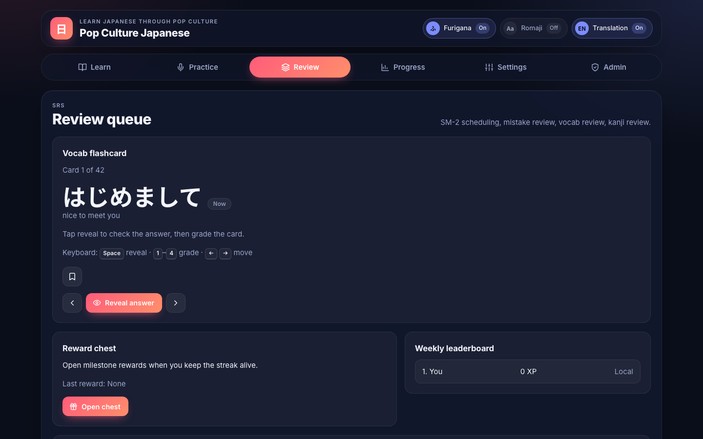
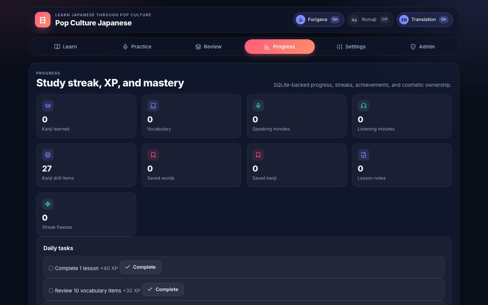
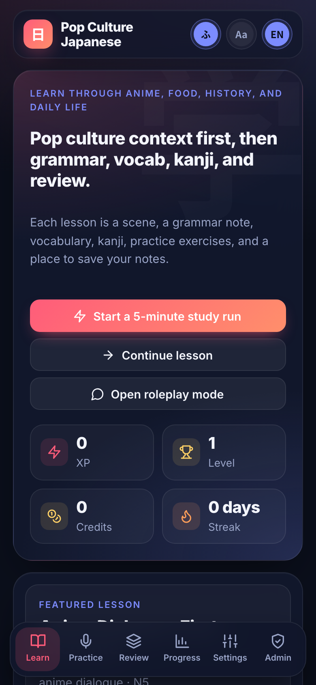
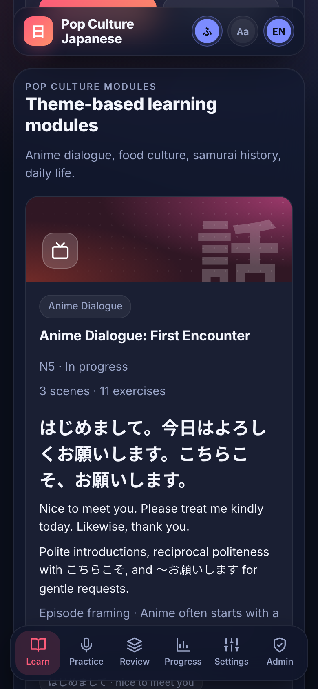
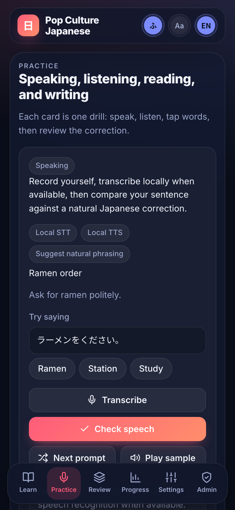
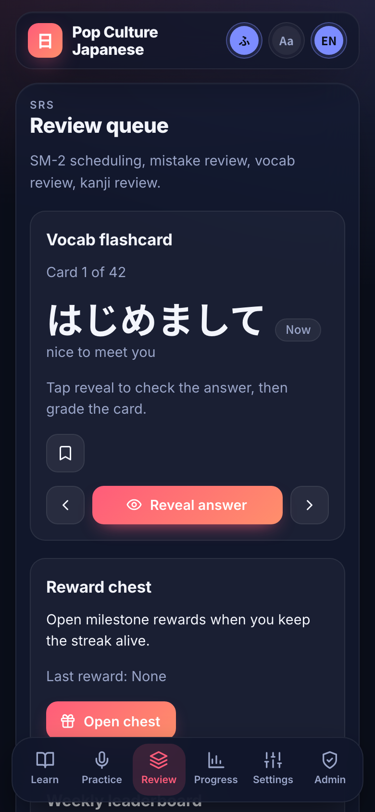

# Pop Culture Japanese

Local-first Japanese learning MVP focused on pop culture modules, SQLite persistence, spaced repetition, gamification, and admin tooling.

## Screenshots

The interface is a dark, card-based layout with an icon navigation bar, icon toggles for furigana, romaji and translation, and illustrated covers for each lesson theme. Each lesson is split into steps (overview, scene, words and kanji, grammar, exercises, notes). On phones the navigation moves to a bottom tab bar and the header stays pinned at the top.

### Desktop

| Learn | Lesson modules |
| --- | --- |
|  |  |

| Practice | Review | Progress |
| --- | --- | --- |
|  |  |  |

### Mobile

| Learn | Lesson card | Practice | Review |
| --- | --- | --- | --- |
|  |  |  |  |

## Requirements

### Required
- Node.js 22 or newer
- A POSIX-like shell for the provided scripts
- SQLite support through Node’s built-in `node:sqlite` module

### Recommended
- macOS or Linux for local system TTS support
- A browser with `SpeechRecognition` support for the best speaking fallback path

### Optional local AI / speech tools
- `whisper` CLI for local speech-to-text
- `say` on macOS or `espeak` for local text-to-speech
- Ollama or any local OpenAI-compatible server if you want the AI tutor / correction paths to use a local model

## Run

```bash
npm run dev
```

Then open `http://127.0.0.1:4173`.

## Install

```bash
bash ./install.sh
```

Or:

```bash
npm run setup
```

## Test

```bash
npm test
```

## Check

```bash
npm run check
```

## What the app includes

- Learn, Practice, Review, Progress, Settings, and Admin screens
- Responsive layout with a bottom tab bar on phones, inline SVG icons (`icons.js`, adapted from Lucide), and themed cover art for each lesson module
- SQLite persistence with a local Node API
- Pop-culture lesson content for anime dialogue, food, samurai/history, manga, daily life, and school/workplace themes
- Furigana, romaji, and translation toggles
- Lesson dialogue scenes, grammar points, exercises, bookmarks, notes, and mastery checklist
- Review queues for vocabulary and kanji with SM-2 scheduling, with keyboard shortcuts on the flashcard (Space to reveal, 1–4 to grade, arrow keys to move)
- Saved study deck for bookmarked words and kanji
- XP, credits, achievements, streaks, streak freezes, daily tasks, cosmetics, and reward chests
- Lesson import, dictionary import, kanji import, review import, and dataset bundle import
- Local admin login, permissions, moderation queue, analytics, AI playground, settings, and backup/restore
- Browser TTS with local system TTS fallback
- Local Whisper-backed transcription when configured
- The default seed starts with lesson content only; sample progress and fake users are not preloaded

## Security notes

The local server only hands out the files the browser needs (the page, its scripts, styles and the README screenshots). The SQLite database, backups, server code and git data are never served, even to the local machine.

## Data storage

The app stores everything in a local SQLite database under:

```text
data/learning-app.sqlite
```

It is created automatically on first run.

## Environment variables

### Server
- `PORT`: HTTP port, default `4173`
- `LEARNINGAPP_DISABLE_SERVER=1`: import the API handler without starting the HTTP server

### Local AI
- `AI_PROVIDER`: set to `ollama` or `openai-compatible`
- `OLLAMA_HOST`: Ollama host URL, if different from the default
- `OLLAMA_MODEL`: Ollama model name to request
- `AI_BASE_URL`: base URL for an OpenAI-compatible local server, default `http://127.0.0.1:1234/v1`
- `AI_MODEL`: model name for OpenAI-compatible local servers

### Speech-to-text
- `WHISPER_BIN`: path to the Whisper CLI binary
- `WHISPER_MODEL`: Whisper model name, default `tiny`
- `WHISPER_MODEL_DIR`: model directory, if needed
- `WHISPER_LANGUAGE`: transcription language, default `ja`

### Text-to-speech
- `TTS_PROVIDER`: set to `say` or `espeak`
- `TTS_BIN`: explicit path to the TTS binary
- `TTS_LANGUAGE`: language code for system TTS

## Content imports

The admin tools accept:
- lesson JSON packs
- raw JMdict XML
- raw KANJIDIC XML
- dictionary entry batches
- kanji entry batches
- review item batches
- full dataset bundles

## Notes

- Core learning still works without any local AI service.
- Browser TTS remains the default if system TTS is unavailable.
- Whisper and local AI providers are optional, not required for the MVP.
- Cosmetics are cosmetic only and do not unlock core learning content.
- The local bootstrap admin account is `admin` / `fieldguide123`.
